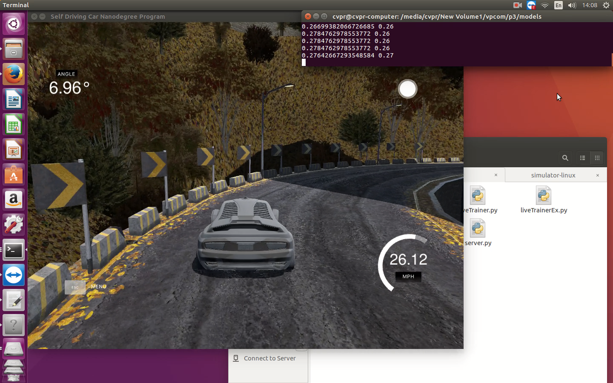

# Udacity Self Driving Car Nanodegree
## Project 3 - Use deep learning to clone driving behavior

Here you can find my implementaion for the behavioral cloning project. Please check this [medium post](https://medium.com/@ValipourMojtaba/probably-smallest-network-for-project-3-d69cc5ee106a#.h5m0z8i2f). 

### Project Goals

In this project we want to design and develop a deep learning model to mimic driving behavior. The input here is an image and the output should be control commands such as Steering Angle. Here for simplicity we just predict steering angle. 

### Simulator

You can download simulator for various platform here: 

- [Linux](https://d17h27t6h515a5.cloudfront.net/topher/2016/November/5831f0f7_simulator-linux/simulator-linux.zip)
- [macOS](https://d17h27t6h515a5.cloudfront.net/topher/2016/November/5831f290_simulator-macos/simulator-macos.zip)
- [Windows 32-bit](https://d17h27t6h515a5.cloudfront.net/topher/2016/November/5831f4b6_simulator-windows-32/simulator-windows-32.zip)
- [Windows 64-bit](https://d17h27t6h515a5.cloudfront.net/topher/2016/November/5831f3a4_simulator-windows-64/simulator-windows-64.zip)

Once you've downloaded it, extract it and run it. 

### My Objectives and Goals

- Limited Model Size 
- Utilize Small Network
- Work for both Track

### Data 

First I generated a large dataset from the simulator with a keyboard but data set was not perfect and there was a lot of noisy samples and the model was not quite good. After that I wrote a code to filter out dataset and keep only the best samples for training. 

```
%matplotlib inline
import time
import pylab as pl
from IPython import display

for idx in range(10,len(drivingLog),20): # init 0/10 
    test = drivingLog['Center'][idx]
    testLabel = drivingLog['Steering Angle'][idx]
    image = loadImg(test, True) 
    cmap=plt.get_cmap('gray'))
    pl.imshow(image)
    display.clear_output(wait=True)
    display.display(pl.gcf())
    print(testLabel, idx)
    time.sleep(0.02)
```

However I found Udacity dataset useful for training and achieving better performance. In the last model I used that data. [Here](https://www.dropbox.com/s/2mfk5a2v2zymr3e/Dataset.zip?dl=0) you can download the train and test set which utilized to train the last model. 

### File Structure

- 'Dataset' (Directory) : Include train and test folder
- 'Elements' (Directory): Include images for the markdown file
- 'drive.py' (File): Main way to run autonomous model 
- 'liveTrainer.py' (File): Alternative way to run autonomous model
- 'server.py' (File): LiveTrainer need this file
- 'model.h5' (File): Model's weights for Keras
- 'model.json' (File): Model's architecture for Keras
- 'model.ipynb' (File): The script used to create and train the model
- 'model.html' (File): The output of jupyter notebook for easy access
- 'README.md' (File): More information about the process

#### Data Visualization

Always the first step to train a model for an specific dataset is visualizing the dataset itself. There is many visualization techniques which we can use but the most straightforward was utilized here. 

This figure shows steering angle, throttle, break and speed in the same figure for train set. In the following pictures you can see more information about the train set. 
<p align="Center">
     
</p>
<p align="Center">
     
</p>
In the test set, actually track 2 was used to validate the model trained by the track 1 and as you can see in the results, the model perform very good in the track which he didn't see anything similar that before. 
<p align="Center">
     
</p>
<p align="Center">
     
</p>

In the following picture, I show some examples from the dataset after loading an image and using some preprocessing like cropping and other technique which is the same for the simulator when I want to test a model. These are the same image which used as an input for training the model. 
<p align="Center">
     
</p>

### Preprocess

As you can see in the above images, the main problem here is imbalance dataset. If you train any model with this pure dataset then you will just overfitted and the model tend to predict zero and straight forward driving. So we really need to figure out the problem. To fix that I was looking for a thermal and proabability variable to force generator generate a balance dataset for the model. However with that approach controling the parameters was hard so I decide to change that to a better and more simple approach. I filtered out the dataset and I keep only 25 percent of zero samples. Here we face to a trade-off and if we keep less or more zero samples depend to the network we will have a more spiky or more straight driving. Actually I design the generator somehow to augment data when we call it. I changed many of my parameters when I see better approach by other people. However to see the final distribution of data I test it using a simple approach. I called my generator for a specific time and then I measured the labels and plot the histogram. You can see the result here:
<p align="Center">
     
</p>
As you can see the above figure show normal distribution which it is very necessary for our model to see the steering angles in a fair approach like gaussian distribution. Because we want to show the model a steering angle and it's importance. So this is really important to augment data somehow to generate fair dataset. I was thinking that before but Vivek show me the right way to do that. Here you can find the code:

```
rows, cols, _ = image.shape
transRange = 100
numPixels = 10
valPixels = 0.4
transX = transRange * np.random.uniform() - transRange/2
steeringAngle = steeringAngle + transX/transRange * 2 * valPixels
transY = numPixels * np.random.uniform() - numPixels/2
transMat = np.float32([[1,0, transX], [0,1, transY]])
image = cv2.warpAffine(image, transMat, (cols, rows))
```
I can say this is the most important part of the code for augmentation. In the above code we want to generate a new image from the current image using random shift in horizontal direction. The change in the steering angle value is 0.4 per pixel and we will limited the change upto 10 pixel and this is important because we don't want to show the model something impossible or a black image. 

To show the network equally left and right turn steering angle I just use 50 percent probability in my generator to generate an image with the right labels otherwise flip the image and change the sign of steering angle. 
```
if np.random.rand() > 0.5: # 50 percent chance to see the right angle
    image = cv2.flip(image,1)
    steeringAngle = -steeringAngle
```

It is important for network to have idea about light so I used two approach to show network more images with different brightness. First I tried to normalize the beightness and find the best brightness invariant image using computer vision technique (Future ToDO) but the easier approach was to add some random value to the V channel of HSV image which is very common in vision community.

After applying above augmentation the generator will generate samples similar to the the following figure:
<p align="Center">
     
</p>

### Architecture 

To design the model I first start from a very simple model. One of my objective was to design a very small network and powerful enough to solve this problem. I really need to visulize the output of the model layers to see what network can see so I wrote a code to visualize the layer which is very simple thanks to keras (most part was implemented before). According to the output I realize that which network is better and this visualization help me to achieve this network. 

Here you can see the model and output of the each layer:

<p align="Center">
     
</p>

Input (?,40,160,3) -> Conv2D (?,40,160,3) -> Conv2D (?,33,153,16) -> MaxPooling (?,16,76,16) -> Dropout (?,16,76,16) -> Conv2D (?,12,72,32)  -> MaxPooling (?,6,36,32) -> Dropout (?,6,36,32) -> Conv2D (?,4,34,32) -> MaxPooling (?,2,17,32) -> Dropout (?,2,17,32) -> FC1 (?,256)  -> Dropout (?,256) -> FC2 (?,128) -> Dropout (?,128) -> FC3 (?,64) -> Dropout (?,64) -> FC4 (?,8) -> Dropout(?,8)  -> Output(?,1)


```
# visualize model layers output
from keras import backend as K
layerOutput = K.function([model.layers[0].input, K.learning_phase()],[model.layers[2].output])
idx = 4000 # this can be anything or even random
test = drivingLog['Center'][idx]
testLabel = drivingLog['Steering Angle'][idx]
image = loadImg(test, True) 
# output in test mode = 0, train mode = 1
layerOutputSample = layerOutput([image.reshape(1,image.shape[0],image.shape[1],image.shape[2]), 1])[0]
layerOutputSample = layerOutputSample.reshape(layerOutputSample.shape[1],layerOutputSample.shape[2],layerOutputSample.shape[3])
print(layerOutputSample.shape)
figure = plt.figure(figsize=(24,8))
factors = [8,4]
for ind in range(layerOutputSample.shape[2]):
    img = figure.add_subplot(factors[0],factors[1],ind + 1)
    #plt.subplot(4, 4, ind + 1)
    val = layerOutputSample[:,:,ind]
    plt.axis("off")
    plt.imshow(val, cmap='gray',interpolation='nearest')
```
In the following figures you can see output of the first, middle and the last layer of convolutional part of my netwrok for a specific sample:

<p align="Center">
     
</p>
<p align="Center">
     
</p>
<p align="Center">
     
</p>

The trainable parameters in my network is 345,645 which is very good and you can fine tune this network live even with the very limited resource.  

### Train Process 

The hardest part was to wait for training process specially when I had no access to a powerful GPU. Because I used adam optimizer, I use this code to train my model in Keras:
```
from keras.callbacks import ModelCheckpoint, ReduceLROnPlateau, LambdaCallback, Callback
numTimes = 10
numEpoch = 10 # 4 + 2
thr = 0.0001 # 0.3
for time in range(numTimes):
    trainGenerator = generateBatch(XTrain, yTrain, batchSize=50, threshold=thr)
    validGenerator = generateBatchVal(XVal, yVal, batchSize=50)
    samplesPerEpoch = 32000 # len(yTrain)
    nbValSamples = 1000
    history = model.fit_generator(trainGenerator, samples_per_epoch=samplesPerEpoch, nb_epoch=numEpoch, validation_data=validGenerator,
                    nb_val_samples=nbValSamples, callbacks=[ModelCheckpoint(filepath="bestVal"+str(time)+".h5", verbose=1, save_best_only=True),
                    ReduceLROnPlateau(monitor="val_loss", factor=0.2, patience=2, min_lr=0.000001)])
    print(thr, 'Time ',time+1)
    thr += (1/(numTimes))
```

### Results

First, I just keep the models that is good enough for validation set (above a thereshold). To evaulate my trained model, I design a code to show me a random sequence with the ground truth and predicted steering angle and I justify the model manually before the run in the simulator. This approach is great if you check that in the ordered dataset according to time. Here you can see the output of this approach for train and test set: 
<p align="Center">
     
</p>
<p align="Center">
     
</p>

Here you can see the results and performance of my model in the track 1 and 2, please click on the images if you want to see the video:

[](https://www.youtube.com/watch?v=0_YOuH6233A)
[](https://www.youtube.com/watch?v=SUPQt7JOSrU)

### How to run? 

It is so easy and straighforward, just make sure you installed everything and run this line of code: 
```
python drive.py model.json
```

This is an alternative method which is useful if you want to train the model live and finetune it. Just use this command: 
```
python liveTrain.py model.json
```

### Acknowledgements

I really want to thanks Todd Gore, Vivek Yadav, Thomas Anthony and Dmitrii Budylskii during this project because I learn new things from them and they shared their resource to me specially Todd which let me to use his computer.

Notice: 
- Live Trainer is belong to Thomas Anthony
- The latest Test set is belong to Dmitrii Budylskii
